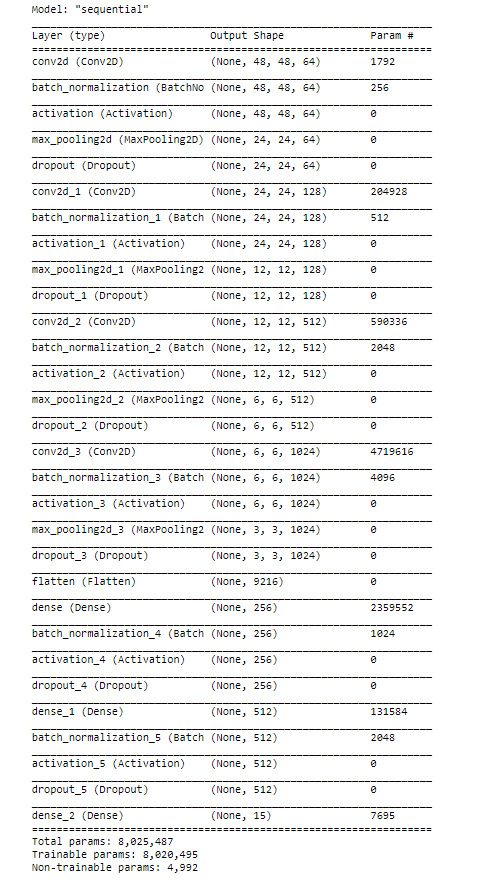

# Auto Chloro - A Plant Disease Classifier & Remedies Provider in Bangla
## About Auto Chloro
Auto Chloro is a plant disease classifier & remedies provider that uses deep learning. It can predict diseases and provide the remedies. The GUI is based on Bangla Language keeping in mind that, our primary target is to create an application to predict plant diseases and provide remedies for the Bangladeshi people.

## How to Use 

To predict the disease click on the "ছবি সিলেক্ট করুন" button.

Select the image from your PC.

Click on the selected image to predict the disease and get the remedies.

Finally, you get the disease name and remedies. 

## Details
### Dataset:
The dataset we will be using contains 17476 images. The train dataset has 16222 images belonging to 15 classes and the test dataset has 1254 images belonging to 15 classes.
Dataset link: https://www.kaggle.com/vasanthkumar14/plant-disease 
### Libraries:
1. Numpy 
2. Matplotlib
3. OS
4. Tensorlow
5. EasyGUI

### CNN Model:

We used a sequential model. The Sequential Model API is a way to build deep learning models that create a sequential class and create and add model layers to it. We used 4 convolutional layers with “Relu” (Rectified Linear Unit) activation functions. The parameters of the first conv2D are, filter-size, kernel-size, Input-shape. The convolutional layer is then pass to MaxPooling layer,pooliing size is the window size. We use Flatten to convert data into 1 Dimensional form. Dense layer feeds all outputs from the previous layer to all its neurons, each neuron providing one output to the next layer. Dropout function is a simple way to prevent overfitting. Dropout is a technique where randomly selected neurons are ignored during training. We used ‘Adam’ as our optimizer to optimize our data with learning rate. A metric is a function that is used to measure the model's performance. Here we take 15 epochs for train our model. More epochs increase the accuracy and decrease the loss (but it takes more time too).

