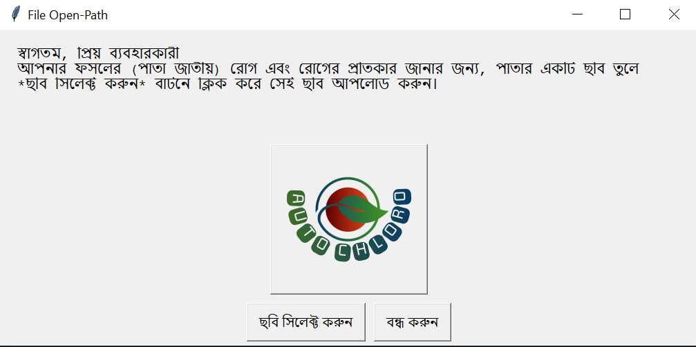
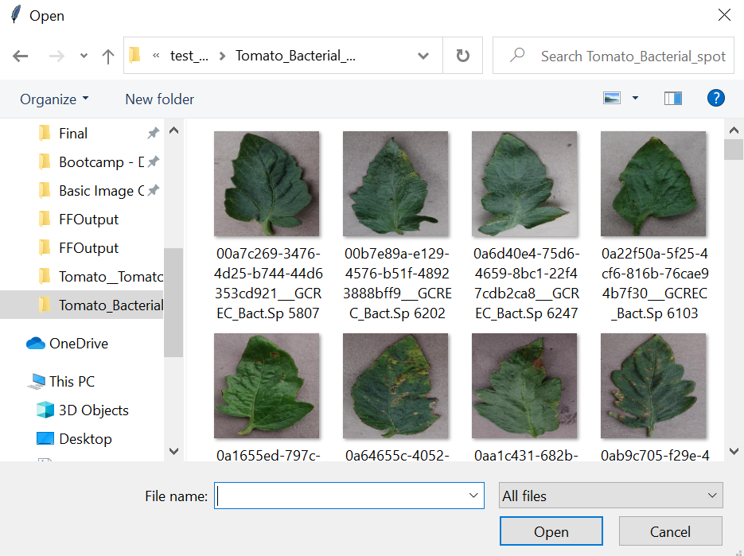
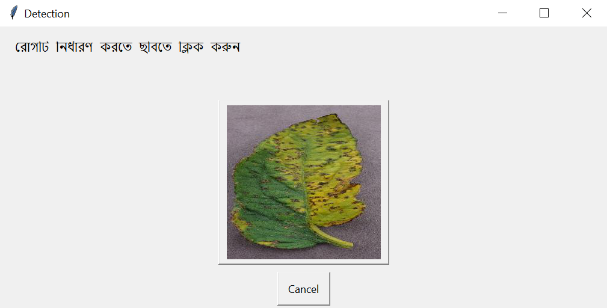
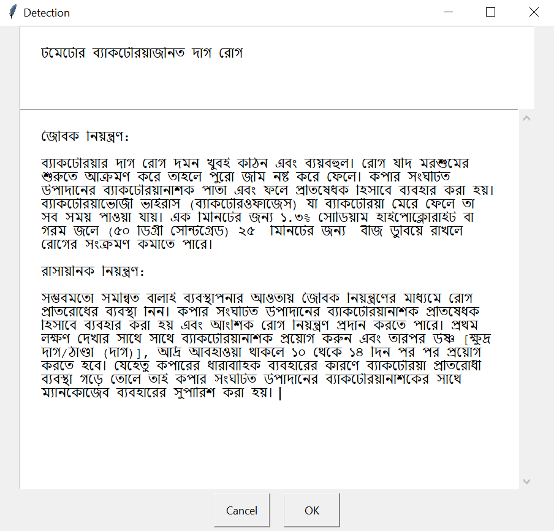

# Auto Chloro - A Plant Disease Classifier & Remedies Provider in Bangla

## Achievement 

- **2nd Runner up in Project Tech Tussle by IEEE Computer Society BRACU Student Chapter**


## About Auto Chloro
Auto Chloro is a plant disease classifier & remedies provider that uses deep learning. It can predict diseases and provide remedies. The GUI is based on Bangla Language keeping in mind that, our primary target is to create an application to predict plant diseases and provide remedies for the Bangladeshi people.


## How to Use 




To predict the disease click on the "ছবি সিলেক্ট করুন" button.





Select the image from your PC.





Click on the selected image to predict the disease and get the remedies.





Finally, you get the disease name and remedies. 

## Details & Breakdown
### Dataset:
The dataset we will be using contains 17476 images. The train dataset has 16222 images belonging to 15 classes and the test dataset has 1254 images belonging to 15 classes.
Dataset link: https://www.kaggle.com/vasanthkumar14/plant-disease 
### Libraries:
1. Numpy 
2. Matplotlib
3. OS
4. Tensorlow
5. EasyGUI

### Generating Images & Processing:

We used os.listdir for fetching the list of all the images in the folder which works as the labels for our dataset. Here we take only the training dataset images from our plant disease dataset. 
This part of code is used to define training and testing data into the model.
```python
img_size=48
batch_size=64
datagen_train=ImageDataGenerator(horizontal_flip=True)
train_generator=datagen_train.flow_from_directory("PlantVillage/My Drive/train_set",
target_size=(img_size,img_size),
batch_size=batch_size,
class_mode='categorical',
shuffle=True)

datagen_test=ImageDataGenerator(horizontal_flip=True)
validation_generator=datagen_test.flow_from_directory("PlantVillage/My Drive/test_data",
target_size=(img_size,img_size),
batch_size=batch_size,
class_mode='categorical',
shuffle=True)

```
We also fixed the image size to (48, 48) and the batch size to 64. We use class mode 'categorical' because more than 2 classes are available here.

### CNN Model:

We used a sequential model. The Sequential Model API is a way to build deep learning models that create a sequential class and create and add model layers to it. We used 4 convolutional layers with “Relu” (Rectified Linear Unit) activation functions. The parameters of the first conv2D are, filter-size, kernel-size, Input-shape. The convolutional layer is then passed to MaxPooling layer,pooling size is the window size.
```python
detection=Sequential()

#1 -convolutional layer-1
detection.add(Conv2D(64,(3,3),padding='same',input_shape=(48,48,3)))
detection.add(BatchNormalization())
detection.add(Activation('relu'))
detection.add(MaxPooling2D(pool_size=(2,2)))
detection.add(Dropout(0.25))

```
We use Flatten to convert data into 1 Dimensional form. Dense layer feeds all outputs from the previous layer to all its neurons, each neuron providing one output to the next layer. Dropout function is a simple way to prevent overfitting. Dropout is a technique where randomly selected neurons are ignored during training.
```python
detection.add(Flatten())
detection.add(Dense(256))
detection.add(BatchNormalization())
detection.add(Activation('relu'))
detection.add(Dropout(0.25))

```
We used ‘Adam’ as our optimizer to optimize our data with learning rate. A metric is a function that is used to measure the model's performance. Here we take 15 epochs for train our model. More epochs increase the accuracy and decrease the loss (but it takes more time too).
```python
optimum=Adam(lr=0.005)
detection.compile(optimizer=optimum,loss='categorical_crossentropy',metrics=['accuracy'])
```
### Saving the Model (h5):

It takes a lot of time to train the model. Therefore, we save the trained model so that we can save time. Moreover, we have to use the saved model in our GUI, as it’s an application.

```python
detection.save('auto_chloro_model.h5') #saving the model
```
```python
detection=load_model('auto_chloro_model.h5') #loading the model
```

### GUI:

We used easygui, a simple GUI framework based on Tkinter. At first, we load the saved model that we trained previously. Basically, we use the fileopenbox function to get the image path. Then, we load the image with load_img method. After that, we covert the images to arrays and expand the dimension where axis=0, it defines the index at which dimension should be inserted. If the input has D dimensions then the axis must have value in the range [-(D+1), D].
We make a list of our labels and use multiple if-else statements to match our prediction with the diseases. Finally, we show the disease name and remedies in textbox.
Noticeable functions that we used for the GUI:

```python

buttonbox()
textbox()
msgbox()

```

We used the button boxes in the selection menu and confirmation menu. File-Open box gets the image path and the text box shows the prediction and remedies.

## Current Status & Bugs:

Currently, we can show the disease properly if the image is good. The model's accuracy is 94-96%. The dataset is not good enough to predict the diseases properly every time.So, it does show wrong outputs sometimes. Here, we have 3 types of plants. The GUI is pretty simple and it was intentional, although it needs more work. Overall, the CNN model is good enough to show some good results and the whole code is working properly.

## Future Plans:
1. Increasing the data, based on Bangladeshi Crops/Plants
2. Creating a website and an app so that it can reach the people easily
3. Better design for the GUI
4. Adding this project to another one which is an automated cultivation system using IOT and ML.  


Collaborator: Sarah Zabeen https://github.com/SarahZabeen
